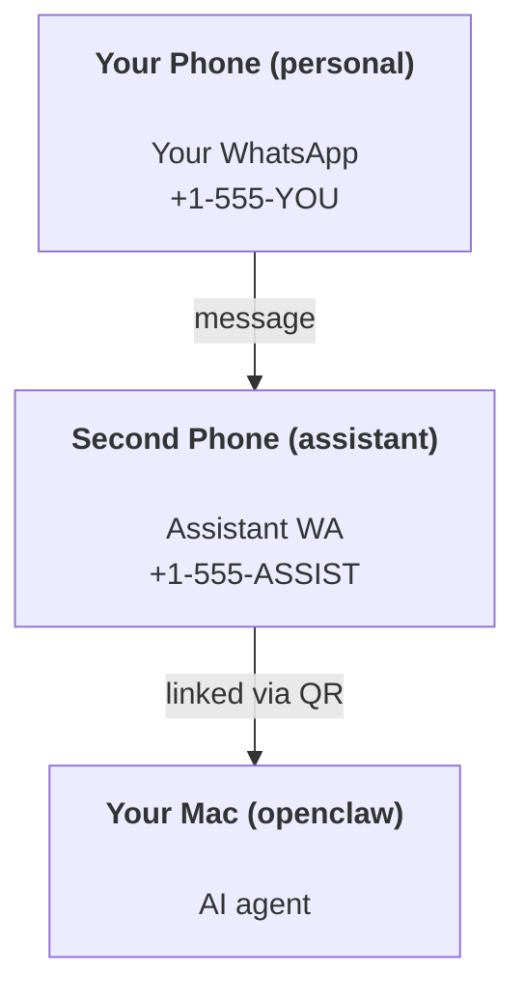

OpenClaw is a self-hosted gateway that connects Discord, Google Chat, iMessage, Matrix, Microsoft Teams, Signal, Slack, Telegram, WhatsApp, Zalo, and more to AI agents. This guide covers the "personal assistant" setup: a dedicated WhatsApp number that behaves like your always-on AI assistant.

## Safety first

Giving an agent a channel puts it in a position to run commands on your machine (depending on your tool policy), read/write files in your workspace, and send messages back out via any connected channel. Start conservative:

- Always set `channels.whatsapp.allowFrom` (never run open-to-the-world on your personal Mac).
- Use a dedicated WhatsApp number for the assistant.
- Heartbeats default to every 30 minutes. Disable until you trust the setup by setting `agents.defaults.heartbeat.every: "0m"`.

## Prerequisites

- OpenClaw installed and onboarded - see [Getting Started](/start/getting-started) if you haven't done this yet
- A second phone number (SIM/eSIM/prepaid) for the assistant

## The two-phone setup (recommended)

You want this:



If you link your personal WhatsApp to OpenClaw, every message to you becomes "agent input". That's rarely what you want.

## 5-minute quick start

1. Pair WhatsApp Web (shows QR; scan with the assistant phone):

```bash
openclaw channels login
```

2. Start the Gateway (leave it running):

```bash
openclaw gateway --port 18789
```

3. Put a minimal config in `~/.openclaw/openclaw.json`:

```json5
{
  gateway: { mode: "local" },
  channels: { whatsapp: { allowFrom: ["+15555550123"] } },
}
```

Now message the assistant number from your allowlisted phone.

When onboarding finishes, OpenClaw auto-opens the dashboard and prints a clean (non-tokenized) link. If the dashboard prompts for auth, paste the configured shared secret into Control UI settings. Onboarding uses a token by default (`gateway.auth.token`), but password auth works too if you switched `gateway.auth.mode` to `password`. To reopen later: `openclaw dashboard`.

## Give the agent a workspace (AGENTS)

OpenClaw reads operating instructions and "memory" from its workspace directory.

By default, OpenClaw uses `~/.openclaw/workspace` as the agent workspace, and creates it (plus starter `AGENTS.md`, `SOUL.md`, `TOOLS.md`, `IDENTITY.md`, `USER.md`) automatically on onboarding or first agent run. `BOOTSTRAP.md` is only created for a brand-new workspace and should not come back after you delete it. `MEMORY.md` is optional and never auto-created; when present, it loads for normal sessions. Subagent sessions only inject `AGENTS.md` and `TOOLS.md`.

<Tip>
Treat this folder like OpenClaw's memory and make it a git repo (ideally private) so your `AGENTS.md` and memory files are backed up. If git is installed, brand-new workspaces are auto-initialized with `git init`.
</Tip>

To create the workspace and config folders without running the full onboarding wizard:

```bash
openclaw setup --baseline
```

(Bare `openclaw setup` is an alias for `openclaw onboard` and runs the full interactive wizard.)

Full workspace layout + backup guide: [Agent workspace](/concepts/agent-workspace)
Memory workflow: [Memory](/concepts/memory)

Optional: choose a different workspace with `agents.defaults.workspace` (supports `~`).

```json5
{
  agents: {
    defaults: {
      workspace: "~/.openclaw/workspace",
    },
  },
}
```

If you already ship your own workspace files from a repo, you can disable bootstrap file creation entirely:

```json5
{
  agents: {
    defaults: {
      skipBootstrap: true,
    },
  },
}
```

## The config that turns it into "an assistant"

OpenClaw defaults to a good assistant setup, but you'll usually want to tune:

- persona/instructions in [`SOUL.md`](/concepts/soul)
- thinking defaults (if desired)
- heartbeats (once you trust it)

Example:

```json5
{
  logging: { level: "info" },
  agents: {
    defaults: {
      model: { primary: "anthropic/claude-opus-4-8" },
      workspace: "~/.openclaw/workspace",
      thinkingDefault: "high",
      timeoutSeconds: 1800,
      // Start with 0; enable later.
      heartbeat: { every: "0m" },
    },
    list: [
      {
        id: "main",
        default: true,
        groupChat: {
          mentionPatterns: ["@openclaw", "openclaw"],
        },
      },
    ],
  },
  channels: {
    whatsapp: {
      allowFrom: ["+15555550123"],
      groups: {
        "*": { requireMention: true },
      },
    },
  },
  session: {
    scope: "per-sender",
    resetTriggers: ["/new", "/reset"],
    reset: {
      mode: "daily",
      atHour: 4,
      idleMinutes: 10080,
    },
  },
}
```

## Sessions and memory

- Session rows, transcript rows, and metadata (token usage, last route, etc): `~/.openclaw/agents/<agentId>/agent/openclaw-agent.sqlite`
- Legacy/archive transcript artifacts: `~/.openclaw/agents/<agentId>/sessions/`
- Legacy row migration source: `~/.openclaw/agents/<agentId>/sessions/sessions.json`
- `/new` or `/reset` starts a fresh session for that chat (configurable via `session.resetTriggers`). If sent alone, OpenClaw acknowledges the reset without invoking the model.
- `/compact [instructions]` compacts the session context and reports the remaining context budget.

## Heartbeats (proactive mode)

By default, OpenClaw runs a heartbeat every 30 minutes with the prompt:
`Follow the heartbeat monitor scratch context when provided. Do not infer or repeat old tasks from prior chats. If nothing needs attention, reply HEARTBEAT_OK.`
Set `agents.defaults.heartbeat.every: "0m"` to disable. Heartbeat checklists live in the monitor's cron scratch (see [Heartbeat](/gateway/heartbeat)); `openclaw doctor --fix` migrates a legacy workspace `HEARTBEAT.md` into it.

- If the monitor scratch exists but is effectively empty (only blank lines, Markdown/HTML comments, Markdown headings like `# Heading`, fence markers, or empty checklist stubs), OpenClaw skips the heartbeat run to save API calls.
- If no scratch exists, the heartbeat still runs and the model decides what to do.
- If the agent replies with `HEARTBEAT_OK` (optionally with short padding; see `agents.defaults.heartbeat.ackMaxChars`), OpenClaw suppresses outbound delivery for that heartbeat.
- By default, heartbeat delivery to DM-style `user:<id>` targets is allowed. Set `agents.defaults.heartbeat.directPolicy: "block"` to suppress direct-target delivery while keeping heartbeat runs active.
- Heartbeats run full agent turns - shorter intervals burn more tokens.

```json5
{
  agents: {
    defaults: {
      heartbeat: { every: "30m" },
    },
  },
}
```

## Media in and out

Inbound attachments (images/audio/docs) can be surfaced to your command via templates:

- `{{MediaPath}}` (local temp file path)
- `{{MediaUrl}}` (pseudo-URL)
- `{{Transcript}}` (if audio transcription is enabled)

Outbound attachments from the agent use structured media fields on the message tool or reply payload, such as `media`, `mediaUrl`, `mediaUrls`, `path`, or `filePath`. Example message-tool arguments:

```json
{
  "message": "Here's the screenshot.",
  "mediaUrl": "https://example.com/screenshot.png"
}
```

OpenClaw sends structured media alongside the text. Legacy final assistant replies may still be normalized for compatibility, but tool output, browser output, streaming blocks, and message actions do not parse text as attachment commands.

Local-path behavior follows the same file-read trust model as the agent:

- If `tools.fs.workspaceOnly` is `true`, outbound local media paths stay restricted to the OpenClaw temp root, the media cache, agent workspace paths, and sandbox-generated files.
- If `tools.fs.workspaceOnly` is `false`, outbound local media can use host-local files the agent is already allowed to read.
- Local paths can be absolute, workspace-relative, or home-relative with `~/`.
- Host-local sends still only allow media and safe document types (images, audio, video, PDF, Office documents, and validated text documents such as Markdown/MD, TXT, JSON, YAML, and YML). This is an extension of the existing host-read trust boundary, not a secret scanner: if the agent can read a host-local `secret.txt` or `config.json`, it can attach that file when the extension and content validation match.

Keep sensitive files outside the agent-readable filesystem, or keep `tools.fs.workspaceOnly: true` for stricter local-path sends.

## Operations checklist

```bash
openclaw status          # local status (creds, sessions, queued events)
openclaw status --all    # full diagnosis (read-only, pasteable)
openclaw status --deep   # probe channels (WhatsApp Web + Telegram + Discord + Slack + Signal)
openclaw health --json   # gateway health snapshot over the WS connection
```

Logs live under `/tmp/openclaw/`: `openclaw-YYYY-MM-DD.log` for the default
profile and `openclaw-<profile>-YYYY-MM-DD.log` for named profiles.

## Next steps

- WebChat: [WebChat](/web/webchat)
- Gateway ops: [Gateway runbook](/gateway)
- Cron + wakeups: [Cron jobs](/automation/cron-jobs)
- macOS menu bar companion: [OpenClaw macOS app](/platforms/macos)
- iOS node app: [iOS app](/platforms/ios)
- Android node app: [Android app](/platforms/android)
- Windows Hub: [Windows](/platforms/windows)
- Linux status: [Linux app](/platforms/linux)
- Security: [Security](/gateway/security)

## Related

- [Getting started](/start/getting-started)
- [Setup](/start/setup)
- [Channels overview](/channels)
